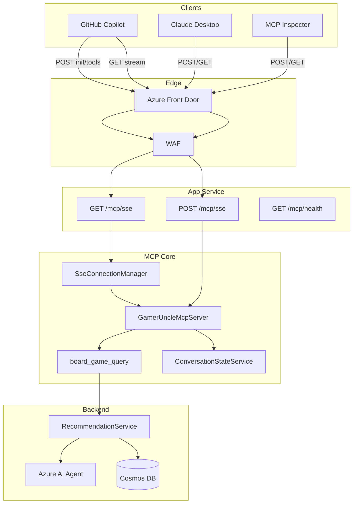
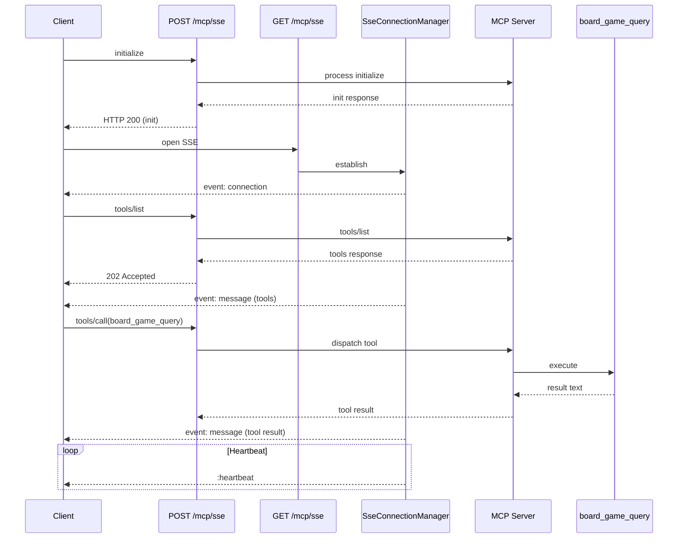
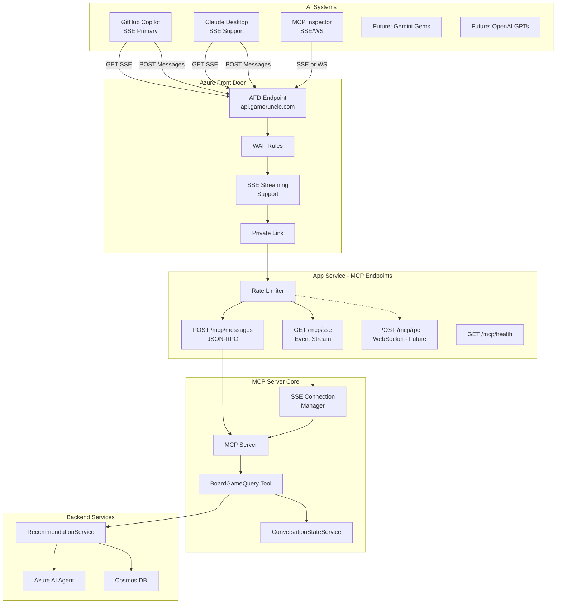
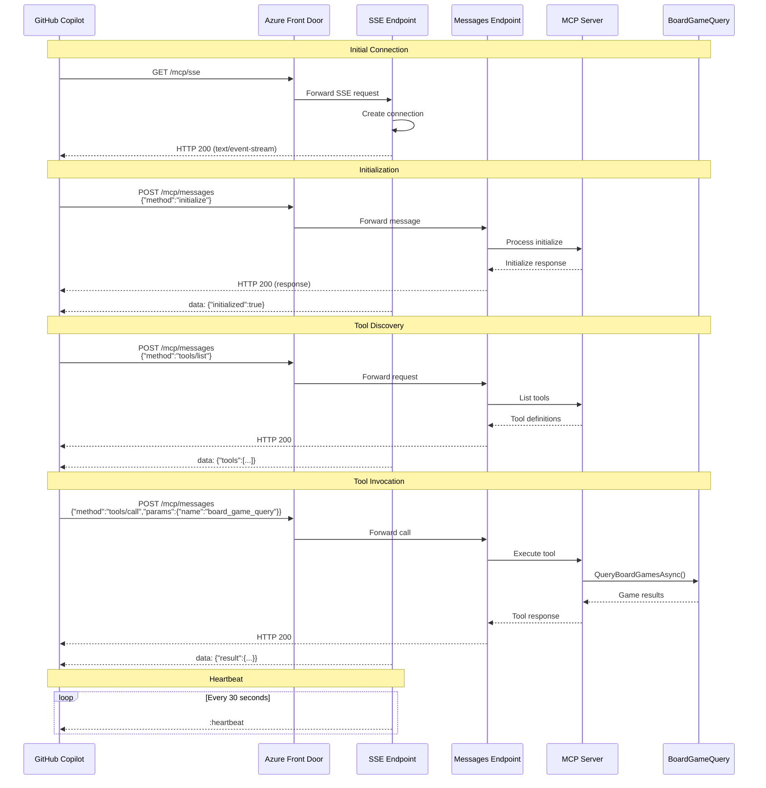

# MCP Implementation Plan - SSE Unified Transport

## Executive Summary

The Gamer Uncle API integrates the Model Context Protocol (MCP) to expose a single tool (`board_game_query`) over a unified Server-Sent Events (SSE) transport with a dual‑purpose endpoint `/mcp/sse`:

- `POST /mcp/sse` handles all client → server JSON-RPC requests (including `initialize`, `tools/list`, `tools/call`, and notifications).
- `GET /mcp/sse` establishes the long-lived SSE stream for server → client responses (`event: connection`, `event: message`, heartbeats).

Key interoperability adjustments were driven by GitHub Copilot’s behavior: (1) it POSTs `initialize` to the same endpoint later used for streaming; (2) it requires an inline HTTP 200 JSON response (not only an SSE emission) to complete initialization. The server now echoes the client-provided `protocolVersion` (fallback: `2024-11-05`) for forward compatibility.

## Core Requirements

1. **Target AI Systems (Phase Order)**
   - Phase 1: GitHub Copilot (primary), Claude Desktop, MCP Inspector, AI Foundry
   - Phase 2: Google Gemini Gems, OpenAI GPTs
2. **Transport**: SSE (unidirectional server stream) + POST (client requests) on one logical endpoint
3. **Fallback Transport**: WebSocket (deferred unless a client requires bidirectional streaming)
4. **Statefulness**: Conversation context preserved per logical session (managed in MCP layer)
5. **Access Model**: Read-only (queries existing recommendation/game data only)
6. **Tool Name**: `board_game_query`

### Endpoint Structure (Current)

```
POST /mcp/sse      → JSON-RPC request (initialize, tools/list, tools/call, notifications/*)
GET  /mcp/sse      → SSE stream (event: connection, event: message, heartbeats)
GET  /mcp/health   → Health probe

Removed (original plan):
POST /mcp/messages  (merged into unified /mcp/sse design)

Future (optional):
POST /mcp/rpc       → WebSocket upgrade (if required)
```

### Rationale for Unified Endpoint
- Reduced race complexity (POST initialize before stream vs after).
- Matches Copilot’s observed behavior (posts to `/mcp/sse`).
- Eliminates redundant rate limiting layers and routing.
- Simplifies client configuration (one base + known endpoints).

## Implementation Summary

### Project Structure
```
services/mcp/
  Tools/BoardGameQueryTool.cs
  Services/
    GamerUncleMcpServer.cs
    ConversationStateService.cs
    SseConnectionManager.cs
  Extensions/ServiceCollectionExtensions.cs
```

### Key Components
| Component | Responsibility |
|----------|----------------|
| `GamerUncleMcpServer` | JSON-RPC dispatch (initialize, tools/list, tools/call) |
| `SseConnectionManager` | SSE lifecycle, queueing, heartbeats, single active consumer model |
| `BoardGameQueryTool` | Implements `board_game_query` using internal recommendation services |
| `ConversationStateService` | Manages per-conversation memory (history, context) |

### Initialize Handling
| Behavior | Details |
|----------|---------|
| Inline response | HTTP 200 + JSON-RPC body always returned for `initialize` |
| SSE replay | Same initialize response also queued & sent if/when SSE attaches (covers race) |
| Protocol version | Echo client `params.protocolVersion`; fallback static default |

### SSE Event Model
| Event | Payload |
|-------|---------|
| `connection` | `{ connectionId, status, messageEndpoint: "/mcp/sse", protocol: "jsonrpc2", transport: "sse" }` |
| `message` | JSON-RPC response object (tool list, tool call result, errors) |
| Heartbeat | `:heartbeat` comment frame every 30s (configurable) |

### Current JSON-RPC Methods
| Method | Status | Notes |
|--------|--------|-------|
| `initialize` | Implemented | Echoes protocolVersion |
| `tools/list` | Implemented | Returns `board_game_query` definition |
| `tools/call` | Implemented | Executes query logic |
| `prompts/list` | Implemented | Returns empty array (no prompts defined yet) |
| `notifications/initialized` | Implemented | Acknowledges client initialization notification |

### Rate Limiting
| Aspect | Current State |
|--------|---------------|
| SSE GET (`/mcp/sse`) | Optional `McpSsePolicy` (non-development) |
| POST (`/mcp/sse`) | No dedicated limiter (simplified) |
| Removed | `McpMessagePolicy` (obsolete) |
| Rationale | Avoid 429 collisions during initialize + stream race |

### Success Criteria (Achieved / Pending)
| Criterion | Status |
|-----------|--------|
| Unified endpoint works with Copilot | ✅ |
| Inline + streamed initialize supported | ✅ |
| Dynamic protocol version echo | ✅ |
| Heartbeats maintain long-lived sessions | ✅ |
| Tool discovery & invocation | ✅ |
| Queue flush on first SSE attach | ✅ |
| Graceful handling unknown methods | ✅ (JSON-RPC error) |
| `prompts/list` implemented | ✅ |
| `notifications/initialized` ack | ✅ |

## Reference Endpoint Mapping (Code Sketch)
```csharp
app.MapPost("/mcp/sse", async (HttpContext ctx, ISseConnectionManager sse, GamerUncleMcpServer server) =>
{
    using var reader = new StreamReader(ctx.Request.Body);
    var body = await reader.ReadToEndAsync();
    var isInit = false;
    try {
        using var doc = System.Text.Json.JsonDocument.Parse(body);
        if (doc.RootElement.TryGetProperty("method", out var m) && m.GetString() == "initialize") isInit = true;
    } catch {}
    var response = await server.ProcessJsonRpcAsync(body);
    if (isInit) {
        ctx.Response.ContentType = "application/json";
        ctx.Response.StatusCode = StatusCodes.Status200OK;
        await ctx.Response.WriteAsync(System.Text.Json.JsonSerializer.Serialize(response));
        await sse.QueueOrSend(response);
        return;
    }
    await sse.QueueOrSend(response);
    ctx.Response.StatusCode = StatusCodes.Status202Accepted;
    await ctx.Response.WriteAsync("Accepted");
});

app.MapGet("/mcp/sse", async (HttpContext ctx, ISseConnectionManager sse) =>
{
    await sse.HandleSseConnection(ctx);
});
```

## Testing Guidance

### Copilot (settings.json excerpt)
```json
{
  "github.copilot.chat.mcpServers": {
    "gamer-uncle-local": {
      "command": "http",
      "args": ["http://localhost:63602"],
      "transport": "sse",
      "endpoints": { "sse": "/mcp/sse" }
    }
  }
}
```

### Curl Quick Start
```bash
# Initialize (inline 200)
curl -X POST http://localhost:63602/mcp/sse \
  -H 'Content-Type: application/json' \
  -d '{"jsonrpc":"2.0","id":1,"method":"initialize","params":{"protocolVersion":"2025-06-18"}}'

# Open SSE (separate terminal)
curl http://localhost:63602/mcp/sse

# List tools
curl -X POST http://localhost:63602/mcp/sse -H 'Content-Type: application/json' \
  -d '{"jsonrpc":"2.0","id":2,"method":"tools/list","params":{}}'

# Tool call
curl -X POST http://localhost:63602/mcp/sse -H 'Content-Type: application/json' \
  -d '{"jsonrpc":"2.0","id":3,"method":"tools/call","params":{"name":"board_game_query","arguments":{"query":"recommend a light engine builder for 2 players"}}}'
```

## Architecture (Mermaid)


## Sequence (Simplified)


## Backlog / Future Enhancements
| Item | Priority | Notes |
|------|----------|-------|
| (reserved) Additional prompts definitions | Low | Populate when first prompt use-case emerges |
| (reserved) notifications enhancements | Low | Metrics or extended handshake if needed |
| Multi-connection broadcast (currently single consumer) | Low | Only needed for multi-view scenarios |
| WebSocket fallback (`/mcp/rpc`) | Low | Defer until a client demands it |
| Structured telemetry (session duration, messages per session) | Medium | For Prod dashboards |
| Rate limiter re-introduction for POST (if abuse) | Low | Monitor first |

## Key Lessons Learned
1. Inline initialize response was mandatory for Copilot readiness.
2. Unified endpoint simplified connection race handling.
3. Dynamic protocol version echo prevents premature incompatibility.
4. Using `event: message` improved client parsing consistency.
5. Queueing before SSE attachment eliminated timing flakiness.

## Success Metrics (Targets)
| Metric | Target |
|--------|--------|
| Initialize latency (P95) | < 500ms |
| Tool call latency (P95) | < 800ms |
| SSE uptime / session | > 30 min continuous |
| Error rate (JSON-RPC) | < 1% excluding unknown methods |
| Availability | 99.9% (MCP endpoints) |

## Implementation Timeline (Current Reality)
| Phase | Status |
|-------|--------|
| Core MCP + SSE | Complete |
| Copilot Handshake Hardening | Complete |
| Dynamic Protocol Version | Complete |
| Prompts & Notifications Support | Complete |
| Telemetry & Metrics | Pending |
| Optional WebSocket | Deferred |

## Next Immediate Options
1. Introduce structured telemetry events (connection_started, message_sent, connection_closed).
2. Decide on multi-connection strategy (keep simple vs broadcast).
3. Define first prompt set (if/when product needs structured prompt surfacing).

---
This document reflects the current working implementation and the divergence from the original dual-endpoint plan. It should be updated again after prompts/notifications support is added.

### Key Design Decisions
- **SSE-first approach**: Optimized for GitHub Copilot compatibility
- **Separate conversation state**: MCP maintains its own context, not shared with `/api/*`
- **Direct service injection**: Tool uses `RecommendationService` directly, not HTTP calls
- **Stateful context**: Accumulates preferences and history within conversation

### Success Criteria
- [ ] Tool discoverable via MCP SDK reflection
- [ ] SSE endpoint streams events successfully
- [ ] POST endpoint processes JSON-RPC messages
- [ ] Conversation state persists across calls
- [ ] RecommendationService integration works

---

## Phase 2: API Integration with SSE Support

### Objective
Host the MCP server within the existing API project, exposing it via SSE and HTTP POST endpoints.

### Components

1. **Project Reference**
   ```xml
   <!-- In GamerUncle.Api.csproj -->
   <ProjectReference Include="..\mcp\GamerUncle.Mcp.csproj" />
   ```

2. **Service Registration in Program.cs**
   ```csharp
   // Register MCP services with SSE support
   builder.Services.AddMcpServices(builder.Configuration);
   builder.Services.AddSingleton<ISseConnectionManager, SseConnectionManager>();
   ```

3. **Endpoint Mapping**
   ```csharp
   // SSE endpoint for server→client streaming
   app.MapGet("/mcp/sse", async (HttpContext context, ISseConnectionManager sseManager) =>
   {
       context.Response.Headers.Add("Content-Type", "text/event-stream");
       context.Response.Headers.Add("Cache-Control", "no-cache");
       context.Response.Headers.Add("Connection", "keep-alive");

       // Handle SSE connection
       await sseManager.HandleSseConnection(context);
   });

   // HTTP POST endpoint for client→server messages
   app.MapPost("/mcp/messages", async (HttpContext context, GamerUncleMcpServer mcpServer) =>
   {
       // Process JSON-RPC request and queue response for SSE
       var response = await mcpServer.ProcessMessage(context);
       return Results.Ok(response);
   });

   // Health check for AFD
   app.MapGet("/mcp/health", () => Results.Ok(new { status = "healthy", transport = "sse" }));

   // Future: WebSocket endpoint (Phase 1.5)
   // app.MapPost("/mcp/rpc", ...) - deferred
   ```

4. **Configuration (appsettings.{Environment}.json)**
   ```json
   {
     "Mcp": {
       "EnableSse": true,
       "EnableWebSocket": false,
       "ConversationLifetimeHours": 2,
       "EnableDetailedLogging": true,
       "MaxQueryHistorySize": 20,
       "SseHeartbeatIntervalSeconds": 30
     }
   }
   ```

### SSE Implementation Details

- **Event Format**: Standard SSE with `data:` prefix for JSON payloads
- **Heartbeat**: Send `:heartbeat\n\n` every 30 seconds to keep connection alive
- **Error Handling**: Graceful reconnection support with event IDs
- **Connection Management**: Track active SSE connections per client

### Key Understanding
- **SSE is unidirectional**: Server sends events, client sends via POST
- **JSON-RPC over SSE**: Each SSE event contains a JSON-RPC message
- **Stateful connections**: SSE connection ID links to conversation state

### Success Criteria
- [ ] `/mcp/sse` establishes SSE connection
- [ ] `/mcp/messages` processes JSON-RPC requests
- [ ] `/mcp/health` returns 200 OK with transport info
- [ ] SSE heartbeat keeps connections alive
- [ ] MCP methods (initialize, tools/list, tools/call) work over SSE+POST

---

## Phase 3: Testing Infrastructure

### Objective
Enable comprehensive testing with various AI tools and clients, focusing on SSE transport.

### Testing Approach by Environment

#### **Local Development (No Security)**

##### GitHub Copilot Configuration
```json
// settings.json - SSE transport configuration
{
  "github.copilot.chat.mcpServers": {
    "gamer-uncle": {
      "url": "http://localhost:5000",
      "transport": "sse",
      "endpoints": {
        "sse": "/mcp/sse",
        "messages": "/mcp/messages"
      }
    }
  }
}
```

##### MCP Inspector Testing
```bash
# SSE connection test
mcp-inspector connect http://localhost:5000/mcp/sse --transport sse

# Alternative: Use built-in SSE support
mcp-inspector test-sse http://localhost:5000
```

##### Claude Desktop Configuration
```json
// Claude Desktop config - SSE support
{
  "mcpServers": {
    "gamer-uncle": {
      "command": "http",
      "args": ["http://localhost:5000"],
      "transport": "sse",
      "endpoints": {
        "sse": "/mcp/sse",
        "messages": "/mcp/messages"
      }
    }
  }
}
```

#### **Dev/Prod (With AFD)**
- AFD fully supports SSE streaming
- Testing works directly through AFD endpoint:
  ```bash
  # SSE through AFD
  curl -N https://api.gameruncle.com/mcp/sse

  # Messages through AFD
  curl -X POST https://api.gameruncle.com/mcp/messages \
    -H "Content-Type: application/json" \
    -d '{"jsonrpc":"2.0","method":"tools/list","id":1}'
  ```
- GitHub Copilot and Claude Desktop connect to AFD URLs directly
- No special headers needed from clients in Phase 1

#### **SSE Connection Testing Script**
```powershell
# Test SSE connection locally
$response = Invoke-WebRequest -Uri "http://localhost:5000/mcp/sse" `
  -Headers @{"Accept"="text/event-stream"} `
  -TimeoutSec 60 `
  -UseBasicParsing

# Test message sending
$body = @{
  jsonrpc = "2.0"
  method = "tools/list"
  id = 1
} | ConvertTo-Json

Invoke-RestMethod -Uri "http://localhost:5000/mcp/messages" `
  -Method POST `
  -Body $body `
  -ContentType "application/json"
```

### Test Projects

1. **Unit Tests**
   ```
   services/tests/unit/GamerUncle.Mcp.Tests/
   ├── Tools/BoardGameQueryToolTests.cs
   ├── Services/ConversationStateServiceTests.cs
   └── Transports/SseTransportTests.cs
   ```

2. **Functional Tests**
   ```
   services/tests/functional/GamerUncle.FunctionalTests/
   ├── Mcp/McpSseEndpointTests.cs
   └── Mcp/McpMessagesEndpointTests.cs
   ```

### Success Criteria
- [ ] GitHub Copilot connects via SSE and queries games successfully
- [ ] SSE connection remains stable with heartbeats
- [ ] Messages endpoint processes all MCP methods
- [ ] MCP Inspector validates tool discovery
- [ ] Claude Desktop connects and queries
- [ ] All tools work through AFD endpoint

---

## Phase 1.5: Optional WebSocket/RPC Support

### Objective
Add WebSocket/JSON-RPC transport as a fallback for clients that don't support SSE.

### Implementation
```csharp
// Add WebSocket endpoint only if needed
if (configuration.GetValue<bool>("Mcp:EnableWebSocket"))
{
    app.MapWhen(
        context => context.Request.Path == "/mcp/rpc" &&
                   context.WebSockets.IsWebSocketRequest,
        wsApp =>
        {
            wsApp.UseWebSockets();
            wsApp.Run(async context =>
            {
                // Handle WebSocket JSON-RPC
                await mcpServer.HandleWebSocketConnection(context);
            });
        });
}
```

### Configuration Toggle
```json
{
  "Mcp": {
    "EnableSse": true,        // Primary transport
    "EnableWebSocket": false  // Enable only if clients require it
  }
}
```

---

## Phase 4: Rate Limiting (Updated – Unified Endpoint)

### Objective
Introduce protective throttling focused on SSE connection attachment while postponing per‑message rate limiting until real abuse signals appear. The design now uses a unified endpoint (`POST /mcp/sse` for all JSON-RPC requests and `GET /mcp/sse` for the event stream), so the original separate `/mcp/messages` policy is deprecated.

### Design Principles
1. Never 429 the `initialize` handshake under normal usage.
2. Start with connection-level control (SSE GET) only; observe traffic before constraining POST volume.
3. Make it easy to enable a POST limiter later without refactoring.
4. Keep health and diagnostics entirely unthrottled.

### Active Policy (Connection Only)
```json
{
  "RateLimiter": {
    "McpSseConnectionPolicy": {
      "PermitLimit": 5,
      "Window": "00:05:00",
      "QueueLimit": 1,
      "QueueProcessingOrder": "OldestFirst"
    }
  }
}
```

### Application (Current)
```csharp
// Limit concurrent / burst SSE connections per IP
app.MapGet("/mcp/sse")
    .RequireRateLimiting("McpSseConnectionPolicy");

// POST /mcp/sse (initialize, tools/list, tools/call) intentionally NOT rate limited yet
// Rationale: Copilot may send rapid successive calls right after initialization.

// Health endpoint always open
app.MapGet("/mcp/health").AllowAnonymous();
```

### Deferred / Optional Future Policy
```json
// Only introduce if abuse observed (e.g., >60 POSTs / minute / IP)
{
  "RateLimiter": {
    "McpRequestPolicy": {
      "PermitLimit": 20,
      "Window": "00:01:00",
      "QueueLimit": 5
    }
  }
}
```
Would be applied as:
```csharp
// app.MapPost("/mcp/sse").RequireRateLimiting("McpRequestPolicy");
```
With a custom exemption path logic for the very first `initialize` if needed (not implemented yet).

### Environment Profiles (Recommended)
| Environment | Connection Policy (Permit / 5min) | POST Policy | Notes |
|-------------|-----------------------------------|-------------|-------|
| Testing     | Disabled or very high (1000)      | Disabled    | Avoids test flakiness |
| Development | 10                                | Disabled    | Provides light guard |
| Production  | 5                                 | Disabled (observe first) | Enable POST later if abuse |

### Response Semantics (Clarification)
| Request Type | Typical Response | Notes |
|--------------|------------------|-------|
| POST initialize | 200 + inline JSON-RPC result | Also queued to SSE if stream not yet attached |
| POST other methods | 202 Accepted (plain) | Actual JSON-RPC result delivered via SSE `message` event |
| GET /mcp/sse | 200 (SSE stream) | Heartbeats every 30s |
| Rate limit (GET) | 429 JSON error body | Do not open stream |

### Success Criteria (Revised)
- [ ] Zero 429s during normal initialize flows
- [ ] Connection exhaustion prevented (>5 parallel idle connections/IP blocked in prod)
- [ ] Ability to layer POST limiter without code changes (config only)
- [ ] Added latency from limiter < 5ms P95
- [ ] Telemetry baseline (POST volume, connection duration) captured before enabling POST limiting

### Telemetry to Capture Before POST Limiting
| Metric | Purpose |
|--------|---------|
| POST count per IP per minute | Detect spam / loops |
| Tool call latency (p50/p95) | Ensure no hidden contention |
| SSE connection lifetime distribution | Size keep‑alive impact |
| Connection churn rate | Identify reconnect storms |
| Error vs success ratio per method | Spot anomalous patterns |

### Escalation Path
1. Detect abusive POST rates → enable `McpRequestPolicy`.
2. Sustained automated abuse → introduce lightweight auth (API key or signed header) for POST while keeping GET open.
3. Severe distributed abuse → global circuit breaker returning friendly overload JSON-RPC error while preserving SSE heartbeat.

### Rationale (Condensed)
Early POST rate limiting risks breaking Copilot’s burst of initial discovery calls and offers little cost savings because actual expense resides in downstream agent inference (which is already guarded). Connection limiting provides immediate resource protection with minimal complexity.

---

## Phase 5: Telemetry and AI System Tracking

### Objective
Track which AI systems are using our MCP tools with SSE-specific metrics.

### Components

1. **AI System Detection (Enhanced for SSE)**
   ```csharp
   public class McpTelemetryService
   {
       private string IdentifyAISystem(HttpContext context)
       {
           var userAgent = context.Request.Headers["User-Agent"].FirstOrDefault() ?? "";
           var acceptHeader = context.Request.Headers["Accept"].FirstOrDefault() ?? "";

           // Check for SSE-specific patterns
           if (acceptHeader.Contains("text/event-stream"))
           {
               return userAgent switch
               {
                   var ua when ua.Contains("GitHub-Copilot") => "GitHub Copilot (SSE)",
                   var ua when ua.Contains("Claude") => "Claude Desktop (SSE)",
                   _ => "Unknown SSE Client"
               };
           }

           return userAgent switch
           {
               var ua when ua.Contains("MCP-Inspector") => "MCP Inspector",
               var ua when ua.Contains("insomnia") => "Insomnia",
               var ua when ua.Contains("PostmanRuntime") => "Postman",
               _ => "Unknown"
           };
       }
   }
   ```

2. **SSE-Specific Metrics**
   - SSE connection duration
   - Messages per SSE session
   - Heartbeat success rate
   - Connection drop reasons
   - Reconnection frequency

3. **Structured Logging**
   ```csharp
   _logger.LogInformation("MCP SSE event",
       new {
           EventType = "sse_connection",
           AISystem = aiSystem,
           ConnectionId = connectionId,
           Transport = "sse",
           Duration = connectionDuration,
           MessagesProcessed = messageCount
       });
   ```

### Success Criteria
- [ ] SSE connections tracked separately
- [ ] AI system identification includes transport type
- [ ] Connection lifecycle metrics captured
- [ ] Dashboard shows SSE vs WebSocket usage (when both enabled)

---

## Phase 6: Documentation and Architecture Diagrams

### Architecture Diagram (SSE-Focused)


### SSE Sequence Diagram


### Success Criteria
- [ ] Architecture diagram shows SSE-first approach
- [ ] Sequence diagram illustrates SSE + POST flow
- [ ] Documentation explains transport choice rationale

---

## Phase 7: Production Readiness

### Components

1. **Environment Variables (SSE-Specific)**
   ```bash
   # Azure App Service Configuration
   Mcp__EnableSse=true
   Mcp__EnableWebSocket=false
   Mcp__SseHeartbeatIntervalSeconds=30
   Mcp__ConversationLifetimeHours=4
   ```

2. **CI/CD Pipeline Updates**
   ```yaml
   - task: DotNetCoreCLI@2
     displayName: 'Test SSE Transport'
     inputs:
       command: 'test'
       projects: 'services/tests/unit/GamerUncle.Mcp.Tests/*.csproj'
       arguments: '--filter Category=SseTransport'
   ```

3. **Monitoring Setup (SSE-Specific)**
   - SSE connection count by AI system
   - Average SSE session duration
   - Message throughput per connection
   - Heartbeat effectiveness
   - Reconnection patterns

4. **AFD Configuration for SSE**
   - Enable response buffering bypass for SSE
   - Configure appropriate timeouts for long-lived connections
   - WAF rules to allow SSE traffic patterns

### Success Criteria
- [ ] SSE endpoints deployed to all environments
- [ ] AFD properly configured for SSE streaming
- [ ] Monitoring captures SSE-specific metrics
- [ ] GitHub Copilot successfully connects in production

---

## Phase 8: Easy Auth Configuration (Future)

### Objective
Enable Azure App Service Easy Auth for the MCP endpoints when authentication becomes necessary.

### Configuration Steps

1. **Enable Authentication (App Service → Authentication)**
   - Provider: Microsoft Entra ID
   - Unauthenticated requests: Require authentication (401)
   - Excluded paths (initial): `/api/*`
   - Included paths: `/mcp/*`

2. **Token Audience Setup**
   Create two Entra applications:
   - API (resource): `GamerUncle-API` — expose an Application ID URI (`api://<api-app-id>`)
   - MCP client: `GamerUncle-MCP-Client` — client credentials flow

   Allowed token audiences (App Service auth config): `api://<api-app-id>`

3. **Path-Based Authentication Rules**
   ```json
   {
     "routes": [
       {
         "path": "/mcp/*",
         "allowedRoles": ["MCP.Access"]
       },
       {
         "path": "/api/*",
         "allowAnonymous": true
       }
     ]
   }
   ```

4. **MCP Client Token Flow**
   ```csharp
   // MCP clients obtain token via client credentials
   var token = await GetTokenAsync(
       clientId: "mcp-client-id",
       clientSecret: "mcp-client-secret",
       scope: "api://<api-app-id>/.default"
   );

   // Include token in requests
   httpClient.DefaultRequestHeaders.Authorization =
       new AuthenticationHeaderValue("Bearer", token);
   ```

### SSE-Specific Authentication Considerations
- SSE connections inherit authentication from initial HTTP request
- Token passed in initial GET /mcp/sse request
- Messages endpoint requires token in each POST
- Connection persists even after token expiry (validate on message processing)

### Configuration (appsettings.{Environment}.json)
```json
{
  "Features": {
    "RequireMcpAuthentication": false  // Enable when ready
  },
  "Authentication": {
    "ClientId": "<api-app-id>",
    "TenantId": "<tenant-id>",
    "Audience": "api://<api-app-id>"
  }
}
```

### Testing with Authentication
```bash
# Get token for testing
TOKEN=$(az account get-access-token --resource api://<api-app-id> --query accessToken -o tsv)

# SSE with authentication
curl -N https://api.gameruncle.com/mcp/sse \
  -H "Authorization: Bearer $TOKEN"

# Messages with authentication
curl -X POST https://api.gameruncle.com/mcp/messages \
  -H "Authorization: Bearer $TOKEN" \
  -H "Content-Type: application/json" \
  -d '{"jsonrpc":"2.0","method":"tools/list","id":1}'
```

### Success Criteria
- [ ] `/mcp/*` requires valid Entra ID token
- [ ] `/api/*` remains anonymous until mobile login ships
- [ ] SSE connections authenticated at establishment
- [ ] Messages endpoint validates token per request
- [ ] AFD + WAF provide perimeter security

---

## Implementation Timeline

| Phase | Duration | Focus |
|-------|----------|-------|
| 1. Core MCP | 2 days | BoardGameQuery tool with SSE support |
| 2. API Integration | 1 day | SSE + Messages endpoints |
| 3. Testing | 2 days | Verify GitHub Copilot + other tools |
| 1.5. WebSocket | 0.5 days | Optional fallback (if needed) |
| 4. Rate Limiting | 0.5 days | SSE + Message limits |
| 5. Telemetry | 2 days | SSE-specific tracking |
| 6. Documentation | 1 day | Diagrams and docs |
| 7. Production | 1.5 days | Deployment with SSE support |
| 8. Easy Auth | Future | When authentication needed |

**Total: ~10.5 days** (including optional WebSocket support)

---

## Key Insights from SSE-First Approach

1. **GitHub Copilot Compatibility**: SSE is the preferred transport for Copilot integration
2. **Simpler Authentication**: Standard HTTP headers work seamlessly with SSE
3. **AFD Native Support**: Azure Front Door handles SSE streaming without special configuration
4. **Progressive Enhancement**: Start with SSE, add WebSocket only if specific clients require it
5. **Debugging Ease**: SSE events are visible in browser DevTools and standard HTTP tools
6. **Connection Management**: Simpler than WebSocket with automatic reconnection support
7. **Rate Limiting**: Can apply different limits to connections vs messages

---

## Success Metrics

- **Functional**: BoardGameQuery tool works via SSE transport
- **Performance**: <100ms to establish SSE connection, <500ms P95 for tool calls
- **Stability**: SSE connections remain stable for >30 minutes
- **Compatibility**: GitHub Copilot successfully uses the tool
- **Security**: Protected by AFD WAF and rate limiting
- **Adoption**: Track usage across different AI systems and transports
- **Reliability**: 99.9% uptime for MCP endpoints

---

## Testing Checklist

### Local Development Testing
- [ ] SSE connection establishes successfully
- [ ] Heartbeats sent every 30 seconds
- [ ] Messages endpoint processes JSON-RPC
- [ ] GitHub Copilot connects and queries games
- [ ] MCP Inspector validates tool schema
- [ ] Claude Desktop successfully connects

### Integration Testing
- [ ] SSE through AFD works correctly
- [ ] Connection survives for extended periods
- [ ] Reconnection works after network interruption
- [ ] Rate limiting applies correctly
- [ ] Multiple concurrent SSE connections supported

### Production Validation
- [ ] Monitoring shows SSE connections
- [ ] No memory leaks with long-lived connections
- [ ] Heartbeats prevent timeout disconnections
- [ ] AI system identification accurate

---

## Next Steps

1. Review and approve this SSE-first implementation plan
2. Set up development environment with MCP SDK
3. Create feature branch for SSE implementation
4. Implement SSE transport and connection manager
5. Test with GitHub Copilot locally
6. Add WebSocket support only if testing reveals need
7. Deploy to development environment for broader testing