# ✅ Production Pipeline Extension - COMPLETED

## 🎯 Objective Achieved
Successfully extended the Azure DevOps pipeline to include **production deployment with gradual progression** where dev resources act as gatekeepers for production deployments.

## 📊 Implementation Summary

### ✅ Production Stages Added
1. **ProdDeployApi** - Production API deployment
2. **ProdDeployFunctions** - Production Functions deployment  
3. **ProdDeployMobile** - Production Mobile deployment
4. **FunctionalTestsProd** - Production functional testing
5. **E2ETestsProd** - Production E2E testing

### 🔒 Gatekeeping Mechanism
- **Dev Functional Tests** + **Dev E2E Tests** = **✅ Gate to Production**
- **Main Branch Only** - No PR deployments to production
- **Environment-based Approvals** - Uses Azure DevOps environments

### 🏗️ Pipeline Architecture

```mermaid
graph LR
    A[DevBuild] --> B[DevTest]
    B --> C[DevDeploy*]
    C --> D[DevFunctionalTests]
    C --> E[DevE2ETests]
    D --> F{Gate}
    E --> F
    F -->|✅ Pass| G[ProdDeploy*]
    G --> H[ProdTests]
    F -->|❌ Fail| I[Block Prod]
```



## 🧪 Test Validation

### Pipeline Tests Status: **50/50 PASSED** ✅
- ✅ Production stages exist and are properly configured
- ✅ Gatekeeping dependencies are correctly set up
- ✅ Main branch only conditions are enforced
- ✅ Production service connections are configured
- ✅ Resource naming conventions follow prod standards
- ✅ Environment variables are set correctly for prod

## 🔧 Key Technical Decisions

### 1. **Gradual Progression**
```yaml
# Dev tests must pass before prod deployment
dependsOn: 
  - FunctionalTestsDev
  - E2ETestsDev
condition: |
  and(
    in(dependencies.FunctionalTestsDev.result, 'Succeeded'),
    in(dependencies.E2ETestsDev.result, 'Succeeded')
  )
```

### 2. **Environment Isolation**
- **Dev**: `gamer-uncle-dev-*` resources
- **Prod**: `gamer-uncle-prod-*` resources
- **Separate Service Connections**: Dev and Prod isolated

### 3. **Production Configuration**
- **Higher Game Sync Count**: 1000 (vs 500 in dev)
- **Production Environment Variables**: Proper ASP.NET Core env
- **Stricter Timeouts**: 25min for prod E2E (vs 20min dev)

## 📋 Next Steps for Deployment

### Required Azure DevOps Setup
1. **Create Service Connection**: `gamer-uncle-prod-sc`
   - Connect to your production Azure subscription
   - Grant permissions to production resource group

2. **Configure Environment**: `Prod`
   - Set up approval gates (recommended)
   - Add protection rules
   - Configure reviewers

3. **Environment Variables** (if needed)
   - Production-specific secrets
   - Connection strings
   - API keys

### First Production Deployment
1. **Merge to Main**: This will trigger the full pipeline
2. **Monitor Dev Tests**: Ensure they pass (gatekeepers)
3. **Approve Production**: If using manual approval gates
4. **Validate Production**: Tests will run automatically

## 🎁 Additional Enhancements Added

### 1. **Enhanced Package.json**
```json
"test:e2e:prod": "E2E_BASE_URL=https://gamer-uncle-prod-app-svc.azurewebsites.net playwright test"
```

### 2. **Comprehensive Test Coverage**
- 9 new pipeline validation tests
- Production configuration validation
- Gatekeeping mechanism verification

### 3. **Production-Optimized Settings**
- Function App: Higher sync capacity for production load
- API: Production environment configuration
- Mobile: Production URL endpoints

## 🚀 Ready for Launch!

Your pipeline now implements **enterprise-grade deployment practices**:
- ✅ **Quality Gates**: Dev tests block bad deployments
- ✅ **Environment Isolation**: Separate dev/prod resources
- ✅ **Automated Testing**: Full test coverage at each stage
- ✅ **Safe Rollouts**: Main branch only for production
- ✅ **Monitoring**: Immediate validation after deployment

**The pipeline is ready for production use!** 🎯
