# Production Pipeline Extension

## Overview
Extended the Azure DevOps pipeline to include production deployment with a **gradual progression approach** where dev resources act as gatekeepers for production deployments.

## Pipeline Flow

### Current Development Flow (Unchanged)
1. **Validation** - PR validation (structure checks)
2. **DevBuild** - Build all artifacts (API, Functions, Mobile)
3. **DevTest** - Run unit tests (API, Pipeline, Mobile)
4. **DevDeployApi** - Deploy API to dev environment
5. **DevDeployFunctions** - Deploy Functions to dev environment  
6. **DevDeployMobile** - Deploy Mobile to dev environment
7. **FunctionalTestsDev** - Run functional tests against dev API
8. **E2ETestsDev** - Run E2E tests against dev mobile app

### New Production Flow (Added)
9. **ProdDeployApi** - Deploy API to production (✅ Gated by dev tests)
10. **ProdDeployFunctions** - Deploy Functions to production (✅ Gated by dev tests)
11. **ProdDeployMobile** - Deploy Mobile to production (✅ Gated by dev tests)
12. **FunctionalTestsProd** - Run functional tests against production API
13. **E2ETestsProd** - Run E2E tests against production mobile app

## Gatekeeping Strategy

### ✅ Production Deployment Gates
Production stages only run when:
- **Trigger**: `main` branch only (no PR deployments to prod)
- **Dependencies**: Both `FunctionalTestsDev` AND `E2ETestsDev` must succeed
- **Condition**: 
  ```yaml
  condition: |
    and(
      ne(variables['Build.Reason'], 'PullRequest'),
      eq(variables['Build.SourceBranch'], 'refs/heads/main'),
      in(dependencies.FunctionalTestsDev.result, 'Succeeded'),
      in(dependencies.E2ETestsDev.result, 'Succeeded')
    )
  ```

### 🔒 Safety Mechanisms
1. **No PR to Prod**: Pull requests cannot trigger production deployments
2. **Main Branch Only**: Production only deploys from `main` branch
3. **Dev Test Success Required**: Both functional and E2E tests in dev must pass
4. **Manual Approvals**: Uses Azure DevOps environments for approval gates
5. **Isolated Environments**: Separate service connections and resource groups

## Production Environment Configuration

### Resource Naming Convention
- **Dev**: `gamer-uncle-dev-*`
- **Prod**: `gamer-uncle-prod-*`

### Service Connections Required
- **Dev**: `gamer-uncle-dev-sc` (existing)
- **Prod**: `gamer-uncle-prod-sc` (new - needs to be configured)

### Azure Resources Expected
```
Production Resource Group: gamer-uncle-prod-rg
├── gamer-uncle-prod-app-svc (App Service)
├── gamer-uncle-prod-function (Function App) 
├── gamer-uncle-prod-cosmos (Cosmos DB)
└── Additional prod resources as provisioned
```

## Configuration Differences

### Production vs Development Settings

| Component | Development | Production |
|-----------|-------------|------------|
| **API** | Dev Cosmos endpoint | Prod Cosmos endpoint |
| **Functions** | SyncGameCount=500 | SyncGameCount=1000 |
| **Environment** | Development | Production |
| **E2E Base URL** | dev-app-svc-*.westus-01.azurewebsites.net | gamer-uncle-prod-app-svc.azurewebsites.net |

### Environment Variables
- **Dev**: `ASPNETCORE_ENVIRONMENT=Development`
- **Prod**: `ASPNETCORE_ENVIRONMENT=Production`
- **Functions**: `AZURE_FUNCTIONS_ENVIRONMENT=Production`

## Testing Strategy

### Development Testing (Gatekeepers)
- ✅ **Functional Tests**: Validate API endpoints work correctly
- ✅ **E2E Tests**: Validate complete user workflows
- ✅ **Both must pass** for production deployment to proceed

### Production Testing (Validation)
- 🧪 **Functional Tests**: Verify production API is working
- 🧪 **E2E Tests**: Verify production mobile app is working
- ⚠️ **Stricter timeouts**: Production tests have tighter SLAs

## Deployment Sequence

```mermaid
graph TD
    A[DevBuild] --> B[DevTest]
    B --> C[DevDeployApi]
    B --> D[DevDeployFunctions]  
    B --> E[DevDeployMobile]
    C --> F[FunctionalTestsDev]
    E --> G[E2ETestsDev]
    F --> H{Both Dev Tests Pass?}
    G --> H
    H -->|Yes| I[ProdDeployApi]
    H -->|Yes| J[ProdDeployFunctions]
    H -->|Yes| K[ProdDeployMobile]
    I --> L[FunctionalTestsProd]
    K --> M[E2ETestsProd]
    H -->|No| N[❌ Block Prod Deployment]
```



## Next Steps Required

### 1. Azure DevOps Configuration
- [ ] Create `gamer-uncle-prod-sc` service connection
- [ ] Configure `Prod` environment with approval gates
- [ ] Set up production resource permissions

### 2. Production Resources (Already Provisioned)
- [✅] Production App Service
- [✅] Production Function App
- [✅] Production Cosmos DB
- [✅] Production Resource Group

### 3. Testing Validation
- [ ] Update functional tests to handle prod environment variables
- [ ] Verify E2E tests work with production URLs
- [ ] Test the complete pipeline flow

## Risk Mitigation

### Rollback Strategy
- **Deployment Slots**: Use Azure App Service slots for zero-downtime deployments
- **Database**: Cosmos DB provides point-in-time restore capabilities
- **Monitoring**: Production tests validate deployment success immediately

### Quality Gates
1. **Code Quality**: Unit tests must pass
2. **Integration**: Functional tests validate API contracts  
3. **User Experience**: E2E tests validate complete workflows
4. **Production Validation**: Immediate post-deployment testing

---
**Confidence Level**: High - Standard enterprise deployment pattern with proven gatekeeping mechanisms.
