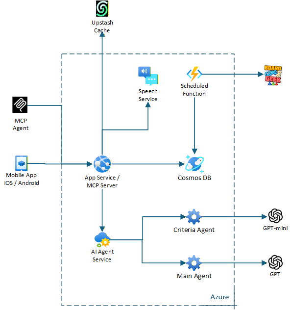

# Gamer Uncle v1 Architecture

This diagram outlines the high-level architecture of the MVP for the Gamer Uncle app.

### Components

- **React Native App** (Expo): UI and user interactions on iOS
- **Azure App Service**: Hosts backend APIs
- **Agent Service (Azure Function)**: Performs long-running or async processing
- **Azure Cosmos DB**: Stores game state, Q&A history, etc.
- **Azure AI Services**: Handles Text-to-Speech and Language understanding
- **External Game API Adapter**: Connects to external board game data sources
