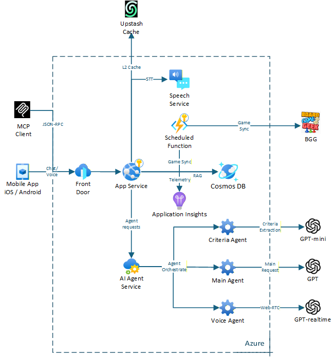

# Gamer Uncle Architecture

This document outlines the architecture of the Gamer Uncle solution as currently deployed across the `dev` and `prod` environments.

## Components

### Clients
- **Mobile App** (React Native / Expo): iOS and Android UI and user interactions. Sends chat/voice requests to the backend.
- **MCP Agent**: External Model Context Protocol clients that talk to the App Service's `/mcp/*` surface over JSON-RPC.

### Edge / Entry Layer
- **Azure Front Door** (`gamer-uncle-prod-afd`, Standard tier): Public entry point for **all** client traffic. A single prod Front Door serves both the `dev` and `prod` endpoints (`gamer-uncle-dev-api-*.z03.azurefd.net` and `gamer-uncle-prod-endpoint-*.z03.azurefd.net`). The mobile app and MCP clients never hit App Service directly.
- **WAF Policy** (`gameruncleprodwaf`, Standard): Attached to Front Door. Provides custom rate-limiting rules (dev 60/min, prod 100/min). App Service is locked down to accept only `AzureFrontDoor.Backend` traffic carrying the matching `X-Azure-FDID` header.

### Compute
- **Azure App Service / MCP Server** (`gamer-uncle-{dev,prod}-app-plan`; dev B1, prod P1v3): Hosts the .NET 8 Web API (`/api/*`), the MCP server surface (`/mcp/*`), and orchestrates chat, voice, and RAG flows. Enforces app-key authentication, rate limiting, and the app version policy.
- **Scheduled Function** (`gamer-uncle-{dev,prod}-function`, Consumption/Y1): Durable Functions app that periodically syncs board game data from BGG into Cosmos DB.

### AI & Voice
- **Azure AI Foundry** (`gamer-uncle-{dev,prod}-foundry`, AI Services S0): Hosts the AI Agent Service and model deployments. The App Service issues agent requests that are orchestrated across:
  - **Criteria Agent** → `gpt-4.1-mini` (criteria extraction)
  - **Main Agent** → `gpt-4.1` (primary chat response)
  - **Voice Agent** → `gpt-realtime` (real-time voice over WebRTC; prod only)
- **Azure Speech Service** (`gamer-uncle-{dev,prod}-speech`; dev F0, prod S0): Speech-to-text (STT) for the voice flow.

### Data & Caching
- **Azure Cosmos DB** (`gamer-uncle-{dev,prod}-cosmos`): Stores board game documents (BGG data) used as RAG input for agent responses and updated by the BGG sync function.
- **Upstash Redis** (external): L2 cache (e.g., criteria cache) to reduce latency and AI calls.

### Security & Configuration
- **Azure Key Vault** (`gamer-uncle-{dev,prod}-vault`, Standard): Stores secrets — app keys, Speech API keys, and the BGG bearer token. App Service and the Function App resolve these via Key Vault references.
- **Managed Identity / Microsoft Entra ID**: All in-Azure service-to-service auth uses `DefaultAzureCredential` (App Service → Cosmos DB and AI Foundry; Function App → Key Vault), so no connection secrets live in code.

### Observability
- **Application Insights** (`gamer-uncle-{dev,prod}-app-insights`): Distributed tracing, request/dependency telemetry, and custom events for the App Service and Function App.
- **Log Analytics Workspace** (`gamer-uncle-{dev,prod}-log-analytics-ws`): Backing store for App Insights and usage analytics (`AppEvents`), with daily caps and (in prod) adaptive sampling.
- **Alerts & Action Group** (see [`infrastructure/alerts/`](../../infrastructure/alerts/main.bicep)): Metric and log alerts wired to an action group for operational notifications.

### Function Storage
- **Storage Account** (`gameruncle{dev,pro}funcstorage`, Standard_LRS): Required backing store for the Function App and Durable Functions state (leases, history, queues).

### External Systems
- **BoardGameGeek (BGG)**: External board game data source consumed by the Scheduled Function during game sync.

## Data Flow

1. **Mobile App / MCP Agent** → **Azure Front Door (+ WAF)** → **App Service / MCP Server** (chat, voice, or JSON-RPC).
2. **App Service** → **Azure AI Foundry (AI Agent Service)** for conversation-aware orchestration across the Criteria, Main, and Voice agents.
3. **App Service** → **Cosmos DB** for RAG input; **App Service** → **Upstash Redis** for L2 caching; voice STT via **Speech Service**.
4. **Scheduled Function** → **BGG** → **Cosmos DB** for background game-data sync.
5. All services authenticate via **Managed Identity / Entra ID** and read secrets from **Key Vault**; telemetry flows to **Application Insights / Log Analytics**.
