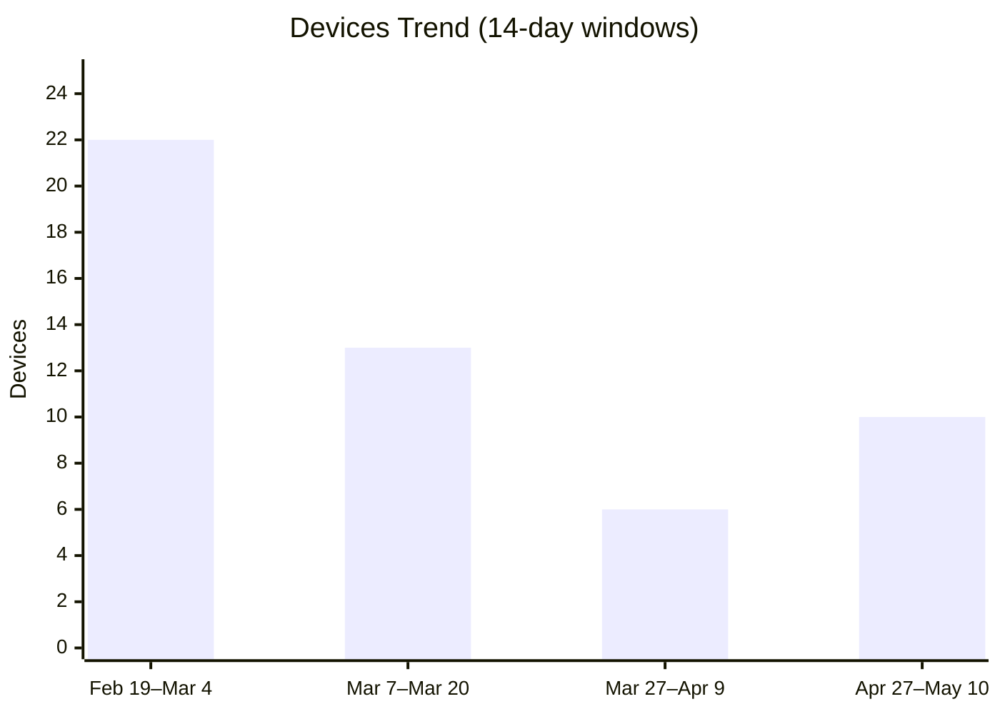
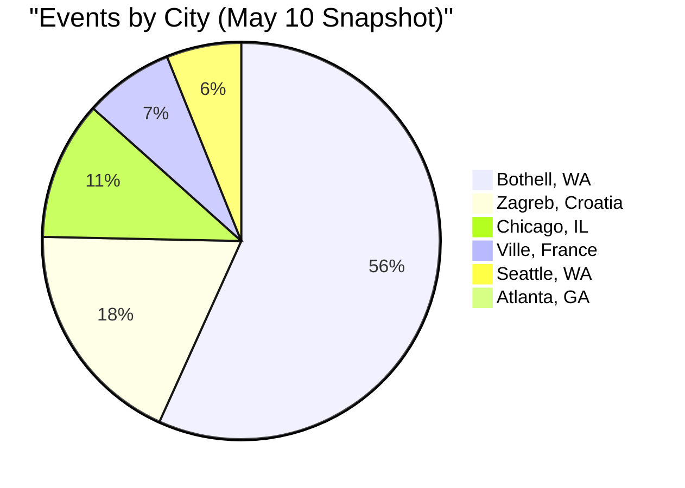
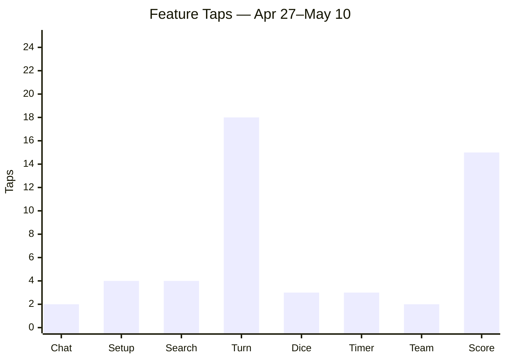

# Usage Analytics — Gamer Uncle

> **Purpose**: Rolling 14-day usage snapshots for tracking user adoption, engagement, and behavior trends over time.
>
> **Data source**: Prod Log Analytics workspace (`AppEvents` table via `gamer-uncle-prod-log-analytics-ws`)
>
> **Exclusions**: Web platform traffic is excluded from all tables — it originates from automated E2E/functional tests in the CI/CD pipeline, not real users.

---

## 1. Adoption Overview

Each row is a 14-day rolling window snapshot taken on the specified date.

| Snapshot Date | Window | Devices | New Users | Sessions | Events | D1 Return Devices | D7 Return Devices |
|---|---|---|---|---|---|---|---|
| 2026-05-10 | Apr 27 – May 10 | 10 | 2 | 20 | 678 | 1 | 1 |
| 2026-04-09 | Mar 27 – Apr 9 | 6 | 2 | 26 | 1,949 | 1 | 1 |
| 2026-03-20 | Mar 7 – Mar 20 | 13 | 8 | 33 | 1,105 | 5 | 0 |
| 2026-03-04 | Feb 19 – Mar 4 | 22 | 17 | 85 | 1,634 | 5 | 1 |

**Key metrics:**
- **Devices**: Distinct `DeviceId` values seen in the window
- **New Users**: Devices that fired `Client.App.FirstOpen`
- **D1 Return Devices**: Devices that fired `Client.App.Returned.D1` (returned within 24h)
- **D7 Return Devices**: Devices that fired `Client.App.Returned.D7` (returned after 7 days)

---

## 2. Geography

> **Note**: Geo data is derived from IP-based geolocation by Application Insights (`ClientCountryOrRegion`, `ClientStateOrProvince`, `ClientCity` fields). Accuracy may vary for VPN or carrier NAT users. This table is **replaced** each snapshot (not appended).

**Snapshot: 2026-05-10 (Apr 27 – May 10) — by country:**

| Country | Devices | Events | % of Events |
|---|---|---|---|
| United States | 8 | 504 | 74% |
| Croatia | 2 | 125 | 18% |
| France | 2 | 49 | 7% |

**Top cities:**

| Country | State/Region | City | Devices | Events |
|---|---|---|---|---|
| United States | Washington | Bothell | 6 | 382 |
| Croatia | Grad Zagreb | Zagreb | 2 | 125 |
| United States | Illinois | Chicago | 1 | 76 |
| France | Oise | Ville | 2 | 49 |
| United States | Washington | Seattle | 2 | 41 |
| United States | Georgia | Atlanta | 1 | 5 |

---

## 3. Feature Engagement

Feature taps from the Landing screen and corresponding screen views. Each feature has its own table for trend tracking.

### Chat (icon + center-circle)

| Snapshot Date | Window | Taps | Unique Devices | Screen Views | View Devices |
|---|---|---|---|---|---|
| 2026-05-10 | Apr 27 – May 10 | 2 | 2 | 2 | 2 |
| 2026-04-09 | Mar 27 – Apr 9 | 19 | 3 | 20 | 3 |
| 2026-03-20 | Mar 7 – Mar 20 | 19 | 8 | 22 | 9 |
| 2026-03-04 | Feb 19 – Mar 4 | 73 | 17 | 82 | 17 |

### Game Setup

| Snapshot Date | Window | Taps | Unique Devices | Screen Views | View Devices |
|---|---|---|---|---|---|
| 2026-05-10 | Apr 27 – May 10 | 4 | 3 | 4 | 3 |
| 2026-04-09 | Mar 27 – Apr 9 | 50 | 2 | 52 | 2 |
| 2026-03-20 | Mar 7 – Mar 20 | 21 | 7 | 21 | 7 |
| 2026-03-04 | Feb 19 – Mar 4 | 51 | 15 | 52 | 15 |

### Game Search

| Snapshot Date | Window | Taps | Unique Devices | Screen Views | View Devices |
|---|---|---|---|---|---|
| 2026-05-10 | Apr 27 – May 10 | 4 | 4 | 4 | 4 |
| 2026-04-09 | Mar 27 – Apr 9 | 22 | 2 | 22 | 2 |
| 2026-03-20 | Mar 7 – Mar 20 | 18 | 10 | 21 | 10 |
| 2026-03-04 | Feb 19 – Mar 4 | 51 | 12 | 59 | 12 |

### Turn Selector

| Snapshot Date | Window | Taps | Unique Devices | Screen Views | View Devices |
|---|---|---|---|---|---|
| 2026-05-10 | Apr 27 – May 10 | 18 | 3 | 34 | 2 |
| 2026-04-09 | Mar 27 – Apr 9 | 70 | 2 | 71 | 2 |
| 2026-03-20 | Mar 7 – Mar 20 | 18 | 8 | 18 | 8 |
| 2026-03-04 | Feb 19 – Mar 4 | 40 | 11 | 40 | 11 |

### Dice Roller

| Snapshot Date | Window | Taps | Unique Devices | Screen Views | View Devices |
|---|---|---|---|---|---|
| 2026-05-10 | Apr 27 – May 10 | 3 | 3 | 3 | 3 |
| 2026-04-09 | Mar 27 – Apr 9 | 3 | 2 | 3 | 2 |
| 2026-03-20 | Mar 7 – Mar 20 | 11 | 6 | 11 | 6 |
| 2026-03-04 | Feb 19 – Mar 4 | 34 | 15 | 34 | 15 |

### Timer

| Snapshot Date | Window | Taps | Unique Devices | Screen Views | View Devices |
|---|---|---|---|---|---|
| 2026-05-10 | Apr 27 – May 10 | 3 | 3 | 4 | 4 |
| 2026-04-09 | Mar 27 – Apr 9 | 4 | 2 | 4 | 2 |
| 2026-03-20 | Mar 7 – Mar 20 | 7 | 5 | 7 | 5 |
| 2026-03-04 | Feb 19 – Mar 4 | 34 | 13 | 34 | 13 |

### Team Randomizer

| Snapshot Date | Window | Taps | Unique Devices | Screen Views | View Devices |
|---|---|---|---|---|---|
| 2026-05-10 | Apr 27 – May 10 | 2 | 2 | 2 | 2 |
| 2026-04-09 | Mar 27 – Apr 9 | 72 | 2 | 72 | 2 |
| 2026-03-20 | Mar 7 – Mar 20 | 13 | 6 | 13 | 6 |
| 2026-03-04 | Feb 19 – Mar 4 | 33 | 12 | 33 | 12 |

### Score Tracker

| Snapshot Date | Window | Taps | Unique Devices | Screen Views | View Devices |
|---|---|---|---|---|---|
| 2026-05-10 | Apr 27 – May 10 | 15 | 6 | 128 | 6 |
| 2026-04-09 | Mar 27 – Apr 9 | 93 | 2 | 174 | 2 |
| 2026-03-20 | Mar 7 – Mar 20 | 36 | 10 | 100 | 10 |
| 2026-03-04 | Feb 19 – Mar 4 | 25 | 10 | 40 | 10 |

### Feature Taps Comparison

---

## 4. Version Adoption

> **Note**: This table is **replaced** each snapshot (not appended) since version mix changes completely across periods.

**Snapshot: 2026-05-10 (Apr 27 – May 10):**

| Version | Sessions | Devices | % of Sessions |
|---|---|---|---|
| 3.6.3 | 19 | 9 | 95% |
| (unknown) | 1 | 1 | 5% |

---

## 6. Rating Prompt

| Snapshot Date | Window | Shown | Dismissed | Rated | Conversion |
|---|---|---|---|---|---|
| 2026-05-10 | Apr 27 – May 10 | 3 | 2 | 1 | 33% |
| 2026-04-09 | Mar 27 – Apr 9 | 173 | 169 | 1 | 1% |
| 2026-03-20 | Mar 7 – Mar 20 | 14 | 13 | 1 | 7% |
| 2026-03-04 | Feb 19 – Mar 4 | 16 | 13 | 3 | 19% |

## 7. Upgrade Prompt

| Snapshot Date | Window | Prompted | Accepted | Dismissed | Conversion |
|---|---|---|---|---|---|
| 2026-05-10 | Apr 27 – May 10 | 0 | 0 | 0 | — |
| 2026-04-09 | Mar 27 – Apr 9 | 0 | 0 | 0 | — |
| 2026-03-20 | Mar 7 – Mar 20 | 0 | 0 | 0 | — |
| 2026-03-04 | Feb 19 – Mar 4 | 5 | 2 | 4 | 40% |

---

## Data Collection Notes

- **Source**: `AppEvents` table in Log Analytics workspace `gamer-uncle-prod-log-analytics-ws` (GUID: `5ae63b98-a993-499d-821b-12dcbbe5fe51`)
- **Excluded**: `platform == 'web'` — web traffic originates from CI/CD functional tests (E2E Playwright), not real users. Confirmed: all 8 web sessions occurred in a single ~20-minute burst on Feb 28 00:33–00:52 UTC with 7 distinct randomly-generated device IDs.
- **Retention**: Log Analytics workspace has 90-day retention. Data older than 90 days will be unavailable.
- **Refresh cadence**: Append new snapshot rows to each table every ~14 days to build trend data.
